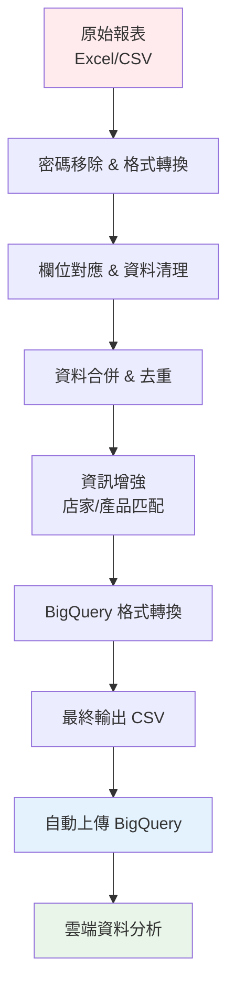

# EC Data Pipeline

> **多平台電商訂單與帳務自動化處理框架**  
> 東森購物、MOMO、PChome、蝦皮、Yahoo 等電商平台報表一鍵整合、清洗、分析、上雲端！


---

## 🌟 專案簡介

EC Data Pipeline 是一個專為台灣電商企業設計的多平台資料整合系統，解決了電商營運中最繁瑣的資料處理痛點。系統支援東森購物、MOMO、PChome、蝦皮、Yahoo 等主要電商平台，提供從原始報表到雲端分析的完整自動化解決方案。

### ✨ 核心價值

- 🔄 **完整 ETL 流程**：從 Excel/CSV 原始檔案到 BigQuery 雲端資料庫的全自動化處理
- 🎯 **智能欄位對應**：根據 JSON 配置自動識別和轉換各平台欄位格式差異
- 🚀 **多平台支援**：支援主流電商平台，可輕鬆擴展新平台
- 📊 **雲端分析就緒**：直接上傳至 Google BigQuery，支援大數據分析和 BI 工具整合
- 🛡️ **企業級安全**：自動密碼處理、完整日誌記錄、錯誤恢復機制
- 🔍 **智能檔案管理**：自動檔案命名、版本控制、重複資料檢測

---

## 🏗️ 系統架構

### 核心模組

#### 1. **東森購物 (ETMall) - 完整 ETL 管線**
完整的 10 階段處理流程，是系統最成熟的模組：

```
01_etmall_platform_orders_cleaner.py    → 平台訂單資料清理 + 標準化
02_etmall_files_archiver.py             → 檔案歸檔管理 + 自動備份
03_etmall_shipping_orders_merger.py     → 出貨訂單合併 + 資料整合
04_etmall_sales_report_merger.py        → 銷售報表合併 + 資料整合
05_etmall_orders_deduplicator.py        → 智能去重處理 + 重複檢測
06_etmall_orders_merger.py              → 出貨訂單與銷售報表合併
07_etmall_orders_datetime_processor.py  → 日期時間格式標準化
08_etmall_orders_field_mapper.py        → 欄位映射轉換 + 英文化
09_etmall_orders_shop_enricher.py      → 商店資料豐富 + 主檔匹配
10_etmall_orders_product_enricher.py    → 產品資料豐富 + 主檔匹配
etmall_to_bigquery_uploader.py          → 專用雲端上傳器
```

#### 2. **MOMO 購物中心 - 雙軌處理系統**
分別處理帳務對帳 (C1105) 和出貨管理 (A1102) 報表：

```
01_rename_and_to_csv_momo_files.py → 檔案重命名 + 格式統一
momo_accounting_cleaner.py         → C1105 帳務對帳清理
momo_shipping_cleaner.py           → A1102 出貨管理清理
03_momo_orders_deduplicator.py     → 重複資料去除
momo_batch_processor.py            → 批次處理協調器
```

#### 3. **Yahoo 購物中心 - 智能檔案處理**
支援多種報表類型的自動識別和處理：

```
01_rename_yahoo_files.py    → 智能檔案重命名（支援 orders, delivery, sps_orders, retgood）
02_yahoo_files_merger.py    → 多檔案合併
03_yahoo_orders_enricher.py → 訂單資料增強
04_yahoo_orders_product_enricher.py → 產品資訊匹配
05_yahoo_orders_bq_formatter.py     → BigQuery 格式化
yahoo_to_bigquery_uploader.py       → 專用上傳器
```

#### 4. **PChome 購物中心 - 彈性處理系統**
```
pchome_cleaner.py          → 訂單資料清理
pchome_return_cleaner.py   → 退貨資料處理
pchome_orders_merger.py    → 資料合併
pchome_xray.py            → 資料品質檢查
```

#### 5. **蝦皮購物 (Shopee) - 統一清理系統**
```
shopee_csv_to_master_cleaner.py → 完整的資料清理和格式化
```

### 支援工具

#### 📁 **檔案處理工具**
- `excel_password_remover/` - 批次移除 Excel 密碼保護
- `clear_logs.py` - 日誌檔案清理工具
- `data_date_checker.py` - 資料日期完整性檢查
- `TreeMaker.py` - 專案結構視覺化工具

#### ☁️ **BigQuery 整合**
- `bigquery_uploader/` - 通用雲端上傳工具組
- `bq_schemas.py` - 資料表結構定義
- `bigquery_utils.py` - BigQuery 操作工具庫

---

## 📁 專案結構

```
ec-data-pipeline/
├── 📂 config/                          # 配置文件
│   ├── 📁 env/                         # 環境配置
│   ├── 📋 A02_Shops_Master.json        # 店家主檔
│   ├── 📋 products.yaml                # 產品主檔
│   ├── 📋 *_fields_mapping.json        # 各平台欄位對應配置
│   ├── 📈 mapping.xlsx                 # 主要欄位定義
│   ├── 📋 ec_shops_universal_passwords.json # 統一密碼管理
│   └── 📋 bigquery_uploader_key.json   # BigQuery 認證金鑰
│
├── 📂 data_raw/                        # 原始資料
│   ├── 📂 etmall/                      # 東森購物原始報表
│   │   └── 📂 backup/                  # 自動備份
│   ├── 📂 momo/                        # MOMO 原始報表
│   ├── 📂 pchome/                      # PChome 原始報表
│   ├── 📂 shopee/                      # 蝦皮原始報表
│   └── 📂 Yahoo/                       # Yahoo 原始報表
│
├── 📂 data_processed/                  # 處理後資料
│   ├── 📂 merged/                      # 最終合併資料
│   │   ├── 📋 etmall_orders_bq_formatted_*.csv
│   │   ├── 📋 momo_accounting_orders_cleaned.csv
│   │   └── 📋 momo_shipping_orders_cleaned.csv
│   ├── 📂 reports/                     # 分析報表
│   ├── 📂 check/                       # 資料檢查結果
│   └── 📂 summary/                     # 摘要資料
│
├── 📂 scripts/                         # 處理腳本
│   ├── 📂 etmall_orders_etl/           # 東森購物 ETL 流程
│   │   ├── 🐍 01_etmall_platform_orders_cleaner.py
│   │   ├── 🐍 02_etmall_files_archiver.py
│   │   ├── 🐍 03_etmall_shipping_orders_merger.py
│   │   ├── 🐍 04_etmall_sales_report_merger.py
│   │   ├── 🐍 05_etmall_orders_deduplicator.py
│   │   ├── 🐍 06_etmall_orders_merger.py
│   │   ├── 🐍 07_etmall_orders_datetime_processor.py
│   │   ├── 🐍 08_etmall_orders_field_mapper.py
│   │   ├── 🐍 09_etmall_orders_shop_enricher.py
│   │   ├── 🐍 10_etmall_orders_product_enricher.py
│   │   ├── 🐍 csv_to_xlsx_monthly.py
│   │   └── 📖 README.md
│   ├── 📂 momo_orders_etl/             # MOMO ETL 處理
│   │   ├── 🐍 01_rename_and_to_csv_momo_files.py
│   │   ├── 🐍 momo_accounting_cleaner.py
│   │   ├── 🐍 momo_shipping_cleaner.py
│   │   ├── 🐍 03_momo_orders_deduplicator.py
│   │   └── 🐍 momo_batch_processor.py
│   ├── 📂 yahoo_orders_etl/            # Yahoo ETL 處理
│   │   ├── 🐍 01_rename_yahoo_files.py
│   │   ├── 🐍 02_yahoo_files_merger.py
│   │   ├── 🐍 03_yahoo_orders_enricher.py
│   │   ├── 🐍 04_yahoo_orders_product_enricher.py
│   │   └── 🐍 05_yahoo_orders_bq_formatter.py
│   ├── 📂 pchome_orders_etl/           # PChome ETL 處理
│   ├── 📂 bigquery_uploader/           # BigQuery 上傳工具
│   │   ├── 🐍 bigquery_uploader.py
│   │   ├── 🐍 etmall_to_bigquery_uploader.py
│   │   ├── 🐍 yahoo_to_bigquery_uploader.py
│   │   ├── 🐍 bigquery_utils.py
│   │   └── 🐍 bq_schemas.py
│   ├── 📂 excel_password_remover/      # Excel 密碼移除工具
│   ├── 🐍 shopee_csv_to_master_cleaner.py
│   ├── 🐍 clear_logs.py               # 日誌清理
│   ├── 🐍 data_date_checker.py        # 日期檢查
│   └── 🐍 TreeMaker.py                # 專案結構工具
│
├── 📂 temp/                            # 臨時處理檔案
│   ├── 📂 etmall/                      # 東森購物處理中檔案
│   ├── 📂 momo/                        # MOMO 處理中檔案
│   ├── 📂 pchome/                      # PChome 處理中檔案
│   ├── 📂 shopee/                      # 蝦皮處理中檔案
│   └── 📂 Yahoo/                       # Yahoo 處理中檔案
│
├── 📂 archive/                         # 歷史歸檔
├── 📂 logs/                            # 系統日誌
├── 📖 README.md                        # 專案說明
└── 📋 requirements.txt                 # 依賴套件
```

---

## ⚡ 快速開始

### 1. 環境準備

```bash
# 克隆專案
git clone <repository-url>
cd ec-data-pipeline

# 安裝依賴套件
pip install -r requirements.txt

# 或使用虛擬環境（推薦）
python -m venv .venv
# Windows
.venv\Scripts\activate
# Linux/macOS
source .venv/bin/activate

pip install -r requirements.txt
```

### 2. 目錄初始化

**Windows CMD:**
```cmd
mkdir config data_raw data_processed archive scripts temp logs
mkdir data_raw\etmall data_raw\momo data_raw\pchome data_raw\shopee data_raw\Yahoo
mkdir data_processed\merged data_processed\summary data_processed\check data_processed\reports
mkdir archive\raw archive\reports
mkdir temp\etmall temp\momo temp\pchome temp\shopee temp\Yahoo
```

**Linux/macOS:**
```bash
mkdir -p {config,data_raw/{etmall,momo,pchome,shopee,Yahoo},data_processed/{merged,summary,check,reports},archive/{raw,reports},temp/{etmall,momo,pchome,shopee,Yahoo},scripts,logs}
```

### 3. 配置設定

1. **複製並編輯配置文件：**
   - `config/mapping.xlsx` - 主要欄位定義
   - `config/*_fields_mapping.json` - 各平台欄位對應
   - `config/products.yaml` - 產品主檔
   - `config/A02_Shops_Master.json` - 店家主檔
   - `config/ec_shops_universal_passwords.json` - 密碼管理

2. **設定 BigQuery 金鑰（如需使用）：**
   - 將 Google Cloud 服務帳號金鑰放置於 `config/bigquery_uploader_key.json`

---

## 🛠️ 使用指南

### 🎯 東森購物 (ETMall) - 完整 ETL + BigQuery 流程

東森購物提供了最完整的 10 階段 ETL 處理流程：

1. **將原始報表放入目錄**
   ```
   data_raw/etmall/東森購物_YYYYMMDD_001.xls
   ```

2. **執行 ETL 流程**（按順序執行）：

   ```bash
   # 階段 1: 平台訂單資料清理與標準化
   python scripts/etmall_orders_etl/01_etmall_platform_orders_cleaner.py
   
   # 階段 2: 檔案歸檔管理與自動備份
   python scripts/etmall_orders_etl/02_etmall_files_archiver.py
   
   # 階段 3: 出貨訂單合併與資料整合
   python scripts/etmall_orders_etl/03_etmall_shipping_orders_merger.py
   
   # 階段 4: 銷售報表合併與資料整合
   python scripts/etmall_orders_etl/04_etmall_sales_report_merger.py
   
   # 階段 5: 智能去重處理與重複檢測
   python scripts/etmall_orders_etl/05_etmall_orders_deduplicator.py
   
   # 階段 6: 出貨訂單與銷售報表合併
   python scripts/etmall_orders_etl/06_etmall_orders_merger.py
   
   # 階段 7: 日期時間格式標準化
   python scripts/etmall_orders_etl/07_etmall_orders_datetime_processor.py
   
   # 階段 8: 欄位映射轉換與英文化
   python scripts/etmall_orders_etl/08_etmall_orders_field_mapper.py
   
   # 階段 9: 商店資料豐富與主檔匹配
   python scripts/etmall_orders_etl/09_etmall_orders_shop_enricher.py
   
   # 階段 10: 產品資料豐富與主檔匹配
   python scripts/etmall_orders_etl/10_etmall_orders_product_enricher.py
   ```

3. **BigQuery 上傳**

   ```bash
   # 使用 ETMall 專用上傳器（推薦）
   python scripts/bigquery_uploader/etmall_to_bigquery_uploader.py
   
   # 支援命令列參數
   python scripts/bigquery_uploader/etmall_to_bigquery_uploader.py --write_disposition WRITE_TRUNCATE
   ```

### 🛒 MOMO 購物中心 - 雙軌處理系統

MOMO 支援帳務對帳 (C1105) 和出貨管理 (A1102) 兩種報表類型：

```bash
# 方法 1: 使用批次處理器（推薦）
python scripts/momo_orders_etl/momo_batch_processor.py          # 執行全部
python scripts/momo_orders_etl/momo_batch_processor.py shipping  # 只執行出貨管理
python scripts/momo_orders_etl/momo_batch_processor.py accounting # 只執行帳務對帳

# 方法 2: 逐步執行
python scripts/momo_orders_etl/01_rename_and_to_csv_momo_files.py
python scripts/momo_orders_etl/momo_shipping_cleaner.py
python scripts/momo_orders_etl/momo_accounting_cleaner.py
python scripts/momo_orders_etl/03_momo_orders_deduplicator.py
```

### 🛍️ Yahoo 購物中心 - 智能檔案處理

Yahoo 支援多種報表類型的自動識別：

```bash
# 完整 ETL 流程
python scripts/yahoo_orders_etl/01_rename_yahoo_files.py      # 智能檔案重命名
python scripts/yahoo_orders_etl/02_yahoo_files_merger.py     # 多檔案合併
python scripts/yahoo_orders_etl/03_yahoo_orders_enricher.py  # 訂單增強
python scripts/yahoo_orders_etl/04_yahoo_orders_product_enricher.py # 產品匹配
python scripts/yahoo_orders_etl/05_yahoo_orders_bq_formatter.py     # BigQuery 格式化

# BigQuery 上傳
python scripts/bigquery_uploader/yahoo_to_bigquery_uploader.py
```

### 🏪 PChome 購物中心

```bash
# 建議執行順序
python scripts/pchome_orders_etl/pchome_cleaner.py
python scripts/pchome_orders_etl/pchome_return_cleaner.py
python scripts/pchome_orders_etl/pchome_orders_merger.py
```

### 🦐 蝦皮購物 (Shopee)

```bash
python scripts/shopee_csv_to_master_cleaner.py
```

### 🔧 工具腳本

#### Excel 密碼移除
```bash
python scripts/excel_password_remover/main.py
```

#### BigQuery 上傳器
```bash
# 通用上傳器（互動式）
python scripts/bigquery_uploader/bigquery_uploader.py

# 命令列模式
python scripts/bigquery_uploader/bigquery_uploader.py --table etmall_orders --write_disposition WRITE_TRUNCATE
```

#### 資料品質檢查
```bash
# 檢查資料日期完整性
python scripts/data_date_checker.py

# 清理日誌檔案
python scripts/clear_logs.py

# 生成專案結構圖
python scripts/TreeMaker.py
```

---

## 📊 BigQuery 整合

### ETMall 專用上傳器特色

- 🎯 **自動檔案抓取**：自動找到最新的 `etmall_orders_product_enriched_*.csv` 檔案（腳本 10 輸出）
- 🔄 **多種上傳模式**：
  - `WRITE_TRUNCATE`：覆蓋模式（清空後上傳）
  - `WRITE_APPEND`：追加模式（在現有資料後追加）
  - `WRITE_EMPTY`：僅空資料表模式
- 🔍 **重複資料檢查**：自動檢查並報告重複的 order_sn
- 📝 **自動欄位處理**：自動添加 `processing_date` 欄位
- 🛡️ **完整錯誤處理**：詳細的日誌記錄和錯誤處理
- 📍 **智能路徑檢測**：支援多種執行目錄
- 📊 **Schema 對應**：64 個欄位完整對應 BigQuery 結構

### 新增功能特色

- 🗂️ **自動檔案清理**：06_etmall_orders_bq_formatter.py 自動清理舊的 BigQuery 格式檔案
- 🎯 **智能去重邏輯**：使用 order_sn + item_no 作為唯一鍵，支援業務跳號（如 item_no = 1, 3）
- 📊 **資料排序優化**：按 order_sn 由小到大排序，每個訂單內按 item_no 排序
- 🧹 **空值處理優化**：自動將 "nan" 字串轉換為空白，確保資料品質
- 🔄 **中間檔管理**：02_etmall_orders_cleaner.py 生成銷售報表和明細報表中間檔

#### 使用方法

**互動式模式（推薦）：**
```bash
python scripts/bigquery_uploader/etmall_to_bigquery_uploader.py
```

**命令列模式：**
```bash
# 覆蓋模式
python scripts/bigquery_uploader/etmall_to_bigquery_uploader.py --write_disposition WRITE_TRUNCATE

# 追加模式
python scripts/bigquery_uploader/etmall_to_bigquery_uploader.py --write_disposition WRITE_APPEND

# 指定特定檔案
python scripts/bigquery_uploader/etmall_to_bigquery_uploader.py --csv data_processed/merged/etmall_orders_bq_formatted_20250807_115715.csv
```

### 資料表結構

系統支援以下 BigQuery 資料表：

- **etmall_orders_data**: 東森購物訂單資料（64 個欄位）
- **c1105_momo_accounting_orders**: MOMO 帳務對帳資料
- **a1102_momo_shipping_orders**: MOMO 出貨管理資料
- **pchome_orders_data**: PChome 訂單資料

---

## 📋 資料流程圖



---

## 🔧 配置說明

### 欄位對應配置

每個平台都有專屬的欄位映射檔案：

- `config/etmall_fields_mapping.json` - 東森購物欄位對應
- `config/momo_fields_mapping.json` - MOMO 欄位對應
- `config/yahoo_fields_mapping.json` - Yahoo 欄位對應
- `config/pchome_fields_mapping.json` - PChome 欄位對應
- `config/shopee_fields_mapping.json` - 蝦皮欄位對應

### 主檔配置

- `config/products.yaml` - 產品主檔，用於產品資訊匹配
- `config/A02_Shops_Master.json` - 店家主檔，用於店家資訊增強

### 密碼管理

- `config/ec_shops_universal_passwords.json` - 統一密碼管理，支援多平台多帳號

### BigQuery 配置

- `config/bigquery_uploader_key.json` - Google Cloud 服務帳號金鑰
- `scripts/bigquery_uploader/bq_schemas.py` - BigQuery 資料表結構定義

---

## 📋 依賴套件

主要依賴包括：

### 核心依賴
- `pandas==2.3.0` - 資料處理核心
- `numpy==2.3.1` - 數值計算
- `openpyxl==3.1.5` - Excel 檔案處理
- `PyYAML==6.0.2` - YAML 檔案處理

### BigQuery 整合
- `google-cloud-bigquery==3.34.0` - BigQuery 客戶端
- `google-auth==2.40.3` - Google Cloud 認證
- `google-cloud-core==2.4.3` - Google Cloud 核心功能

### 安全與工具
- `msoffcrypto-tool==5.4.2` - Excel 密碼移除
- `cryptography==45.0.5` - 加密處理
- `loguru==0.7.3` - 進階日誌處理
- `tqdm==4.67.1` - 進度條顯示

### 資料庫支援
- `psycopg2-binary==2.9.10` - PostgreSQL 支援
- `SQLAlchemy==2.0.41` - ORM 框架

完整依賴請參考 `requirements.txt`。

---

## 🆕 版本更新

### v4.0.0 (2025-08-19) - ETMall ETL 流程全面重構與擴展
- 🔄 **ETMall ETL 全面重構**：從 6 階段擴展為 10 階段完整處理流程
- 🆕 **新增核心腳本**：
  - `01_etmall_platform_orders_cleaner.py` - 平台訂單資料清理與標準化
  - `02_etmall_files_archiver.py` - 檔案歸檔管理與自動備份
  - `03_etmall_shipping_orders_merger.py` - 出貨訂單合併與資料整合
  - `04_etmall_sales_report_merger.py` - 銷售報表合併與資料整合
  - `06_etmall_orders_merger.py` - 出貨訂單與銷售報表合併
  - `07_etmall_orders_datetime_processor.py` - 日期時間格式標準化
  - `08_etmall_orders_field_mapper.py` - 欄位映射轉換與英文化
  - `09_etmall_orders_shop_enricher.py` - 商店資料豐富與主檔匹配
  - `10_etmall_orders_product_enricher.py` - 產品資料豐富與主檔匹配
- 📚 **新增詳細文檔**：`scripts/etmall_orders_etl/README.md` 完整說明腳本功能與執行步驟
- 🔧 **BigQuery 上傳器更新**：支援腳本 10 輸出的新欄位結構
- 📊 **資料豐富化**：自動填入商店和產品相關資訊，提升資料完整性

### v3.0.0 (2025-08-18) - ETMall ETL 流程重構與優化
- 🔄 **ETMall ETL 重構**：將 6 階段 ETL 流程優化，改善資料處理邏輯
- 🎯 **智能去重處理**：新增 03_etmall_orders_deduplicator.py，使用 order_sn + item_no 作為唯一鍵
- 📊 **BigQuery 格式轉換**：新增 06_etmall_orders_bq_formatter.py，自動轉換為 BigQuery 格式
- 🛡️ **檔案管理優化**：自動清理舊檔案，確保只保留最新的輸出檔案
- 🔧 **欄位映射優化**：改善欄位順序處理，參考 etmall_fields_mapping.json
- 📈 **資料品質提升**：優化空值處理，將 "nan" 字串轉換為空白
- 🚀 **多平台支援擴展**：新增 momo 和 yahoo 平台的完整 ETL 腳本

### v2.1.0 (2025-08-07) - ETMall BigQuery 上傳器
- 🚀 **新增功能**：ETMall 專用 BigQuery 上傳器
- 🎯 **自動檔案管理**：智能抓取最新處理檔案
- 🔄 **多種上傳模式**：支援覆蓋、追加、空資料表模式
- 🔍 **重複資料檢查**：自動檢查並報告重複 order_sn
- 📝 **自動欄位處理**：自動添加 processing_date 欄位
- 🛡️ **完整錯誤處理**：詳細日誌記錄和錯誤處理機制
- 📍 **智能路徑檢測**：支援多種執行目錄
- 📊 **Schema 對應**：56 個欄位完整對應 BigQuery 結構

### v2.0.0 (2025-08-05) - 東森購物 ETL 重構
- ✨ **重大更新**：將東森購物 ETL 流程重構為 6 個獨立模組化腳本
- 🔧 優化 Excel 檔案轉換、日期格式化、檔案命名邏輯
- 🛡️ 大幅提升穩定性和重複資料處理能力
- 📊 統一資料清理與增強流程，確保符合 BigQuery 欄位型態要求
- 🎯 新增根據店家主檔和產品主檔自動增強訂單資料功能
- 📈 新增 BigQuery 格式轉換階段

---

## 🏷️ 專案精神

> **多平台不統一？資料處理很複雜？一套系統全搞定！**  
> **讓資料自己清洗、自己對齊、自己上雲端、自己做分析！**

### 🆕 最新特色

- 🔄 **智能 ETL 流程**：ETMall 10 階段 ETL 流程，每個階段都有明確的職責分工
- 🎯 **業務邏輯優化**：支援業務跳號、智能去重、自動檔案清理
- 📊 **資料品質保證**：自動空值處理、欄位型態轉換、資料排序優化
- 🚀 **雲端就緒**：直接輸出 BigQuery 格式，一鍵上傳雲端
- 🏪 **資料豐富化**：自動填入商店和產品相關資訊，提升資料完整性
- 📚 **完整文檔**：詳細的腳本說明和使用指南，便於維護和擴展

---

## 🤝 貢獻指南

1. Fork 本專案
2. 建立功能分支 (`git checkout -b feature/AmazingFeature`)
3. 提交變更 (`git commit -m 'Add some AmazingFeature'`)
4. 推送分支 (`git push origin feature/AmazingFeature`)
5. 開啟 Pull Request

### 貢獻方向

- 新增其他電商平台支援（如：松果購物、生活市集等）
- 改善資料品質檢查工具
- 增加自動化測試覆蓋率
- 優化 BigQuery 上傳效能
- 擴展 BI 工具整合

---

## 📞 聯絡資訊

- **專案維護人**：楊翔志
- **Email**：bruce.yichai20250505@gmail.com
- **專案類型**：企業內部資料處理工具
- **技術支援**：歡迎透過 GitHub Issues 提出問題

---

## 📜 授權條款

本專案採用 MIT 授權條款。詳細資訊請參考 `LICENSE` 文件。

---

## 🔖 附註

### 適用場景

- 多平台電商營運企業
- 需要整合分析不同平台銷售數據
- 希望將資料自動化上傳至雲端進行分析
- 需要建立統一的資料倉儲系統

### 技術特色

- **模組化設計**：每個平台都有獨立的處理流程，易於維護和擴展
- **配置驅動**：透過 JSON 配置檔案控制欄位對應，無需修改程式碼
- **智能錯誤處理**：完整的錯誤捕獲和恢復機制
- **版本控制**：自動檔案備份和版本管理
- **日誌追蹤**：詳細的操作日誌，便於問題排查

### 注意事項

- BigQuery 上傳功能需要有效的 Google Cloud 服務帳號金鑰
- 建議在正式環境使用前，先在測試環境驗證資料處理結果
- 定期檢查和更新各平台的欄位映射配置
- 如需技術支援或功能定制，歡迎聯絡專案維護人

**讓多平台電商資料處理變得簡單，讓商業決策更有效率！** 🚀